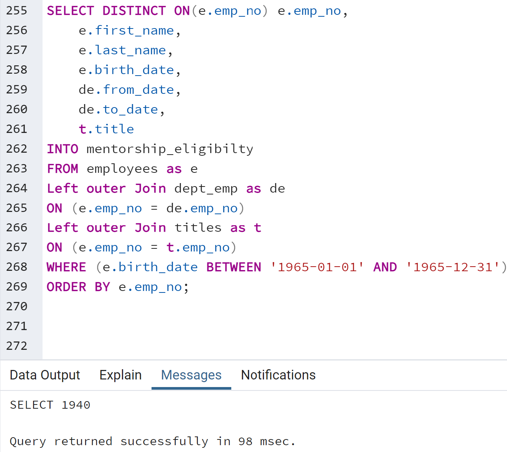

# Overview of the analysis:
To determine the number of retiring employees per title, and identify employees who are eligible to participate in a mentorship program. 

# Results: 
Provide a bulleted list with four major points from the two analysis deliverables. Use images as support where needed.
1. Number of retiring employees per title:
  -
  -
  -
  

2. Identify employees to participate in a mentorship program.
  -
  -
  -

# Summary: 

-How many roles will need to be filled as the "silver tsunami" begins to make an impact?

-Are there enough qualified, retirement-ready employees in the departments to mentor the next generation of Pewlett Hackard employees?

-provide two additional queries or tables that may provide more insight into the upcoming "silver tsunami."
